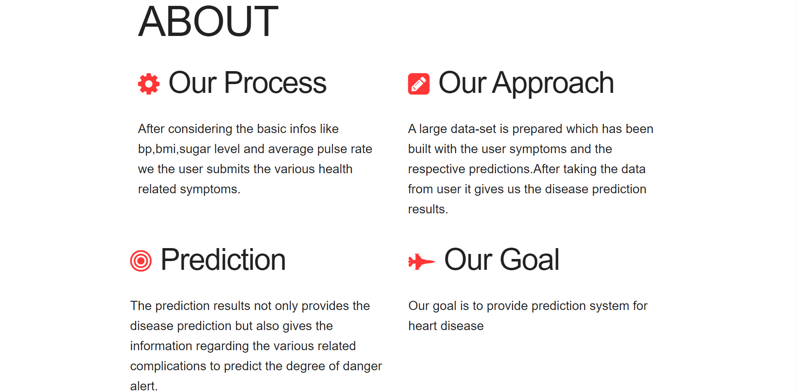
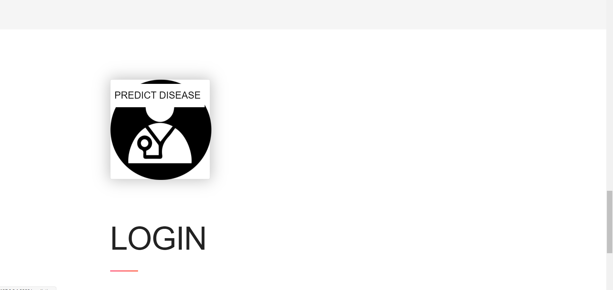
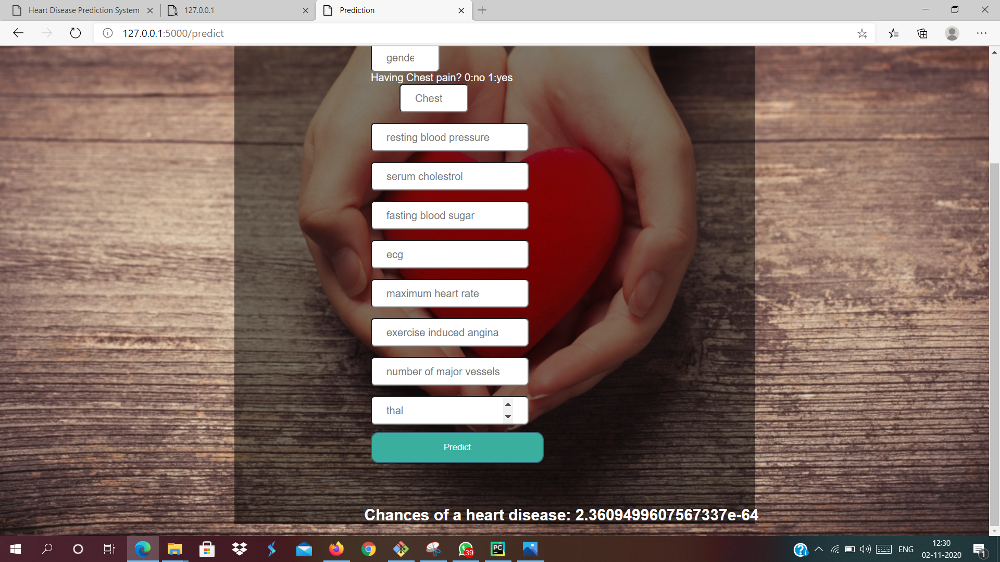

# Hackathon-Heart-care-health-sysytem-
#

This project consists of a ML model in a fully responsive web page that predicts heart disease and correlated complications.
## DESCRIPTION

*Development in Health Sector and Disease prediction Models are in high demand. 
Our Prediction Model takes various inputs from users and predicts the disease and related complications  
So our model 'The heartunerring' gives a approach to solve the heart related errors to help people achieve a healthy heart.let's discuss in detail: *
1. *User-dashboard page:*
The user dashboard takes various inputs like
- Age
- Gender
- Having Chest pain or not?
- Resting Blood pressure
- Serum cholestrol
- Fasting Blood Sugar
- Ecg
- Maxiumum Heart rate
- Exercise induced Angina
- Number of major-vessels
- Thal

2. *Regression Models:* The various data sets are used to make regression models. 
3. *Disease prediction System:User Information Update* The user inputs taken, and the model is trained to predict the heart related diseases and complications.
4. *Disease prediction System:Result * The model predicts the chances of the patient to have heart disease and returns the probability to have a heart disease in the decimal notation where e denotes power of 10 multiplied with the fraction preceding 'e' 
## Dependencies
*Libraries used in project:*
1. Pandas
2. Numpy
3. Seaborn
4. Tensorflow
5. Keras
6. Sci-Kit Learn
7. Flask

#Execution of App
After installing all the required libraries run the app.py file in the terminal.The website starts running on :5000 localhost and the link is provided in the terminal.On visiting the link the user is directed to the home page of the website.

 
 1.The Home Page
   
   
 2.Home page(information about our our model basis)  
   
   
 3.On clicking the card at the bottom will lead the user to the information page
     
   
 4.Provide the required details in the form
   
   
 5.Results get displayed
    
     
## Author
Contributor names

1.Siddharth Sharma

Github : [@pao0318](https://github.com/pao0318)
Email : sharma.siddharthspacex21@gmail.com

2. Sadeep Nanda

Github : [SadeepNanda](https://github.com/SadeepNanda)
Email : sadeepnanda@gmail.com

3. Saily Samanta
s-s5678
Github : [s-s5678](https://github.com/SadeepNanda)
Email : sadeepnanda@gmail.com

## Acknowledgments
- Kaggle (for dataset)
- Stack Overflow
